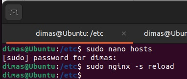
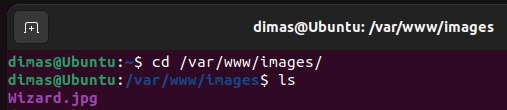
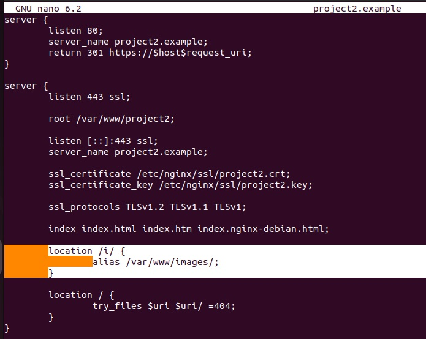

# Лабораторная работа №1

## Задание на лабораторную

В рамках лабораторной:
- Настроим локальные сайты на работу по https c сертификатом
- Настроим принудительное перенаправление HTTP-запросов (порт 80) на HTTPS (порт 443) для обеспечения безопасного соединения.
- Настроим виртуальные хосты для обслуживания нескольких доменных имен на одном сервере.
- Проложим путь к иному каталогу вне заданного сайтам через alias.

## Введение

Иногда разработчку бывает нужно поднять несколько сайтов, заставить их работать по протоклу https и проверить их работоспособность локально. Мы попробуем реализовать нечто похожее, но в заметно меньших размерах.

Преджде, чем приступать к заданию, будет лучше разобраться с каждым его пунктом и понять, что вообще нужно делать и с чем работать.

### Nginx

Nginx - это ПО с открытым исходным кодом для создания веб-серверов. 

При запуске он может выполнять функции прокси сервера - перенапрявлять запросы от пользователя на конкретный сервер (в задании лабораторной эти сервера будут локальными, но данный пункт нам важен).

Другая важная плюшка этого ПО - работа со статическим контентом. По заданию, нам нужно предоставлять пользователю доступ к файлам или каталогам, что является статическим контентом.
Перенаправлять запросы с одного порта на другой для Nginx тоже не является проблемой.

Итак, nginx может делать то, что от мы хотим и это уже прекрасно.

### Https - это кто? who?

Чтобы настроить https, нужно понять, что в этом сложного. Ну, напишем мы порт 443 вместо 80, и?
И ничего не выйдет)

Https - это "надстройка" над http и использованием TSL (ранее SSL). SSL - протокол, который обеспечивает безопасное соединение пользователя с сервером по небезопасной сети. TSL, говоря сильно упрощая, улучшенная версия SSL, этим и ограничимся.

Для установки безопасного соединения SSL и TSL формируют ключи у сервера и пользователя, чтобы нельзя было подключиться к сети и узнать, что там этот проказник (пользователь) творит. Чтобы серверу можно было доверять, он должен предоставить пользователю свой сертификат, который ещё и должен быть подписан, и не абы кем, а корневым удостоверяющим центром (иначе, нас или совсем не пустит на сайт или предложит решить доверяем ли мы этому сайту или нет). Более подробно о SSL и TLS можно почитать в основах https [здесь](#использованные-источники)

В общем, нам нужен будет свой самоподписанный сертификат (даже два). Самостоятельно подписывать такие сертификаты может быть не совсем правильно (или даже незаконно), но мы будем работать с локальными серверами, а потому об этом никто не узнает.

Такс, на данном этапе вся нужная информация собрана и мы можем приступать к выполнению работы.

## Установка nginx и проверка его работоспособности

Установим nginx через apt install.

Запустим его и проверим его работоспособность.

Также посмотрим конфигурацию сайта (default) в sites-available. Тут мы будем в последствии составлять конфигурацию сайтов.

## Создание сертификатов

Создадим директорию в /etc/nginx, в которой будем хранить сертификаты для установления соединения по https. 
Затем создадим конфиг для ключа, сожержане файла представлено на рисунке.

Затем командой создадим ключи сертификата.

Аналогично создадим ключи для второго сайта.

## Настройка принудительного перенаправления http на https и 

В sites-available создадим файл с конфигурацией сайта. В первом блоке будем принимать запросы с порта 80 и перенаправлять на порт 443. Во втором блоке будем принимать запросы с 443 порта с сертификатом, добавим созданные сертификаты и укажем пути к ним, а также оставим блок из конфигурации сайта-примера (default), который будет возвращать ошибку 404, если запрашеваемый файл в выбранной в root директории не найден.

Таким же образом реализуем файл для второго сайта.

Затем в sites-enabled создадим ссылки на наши локальные сайты, чтобы подключить их к nginx. Также удалим ссылку на default, чтобы он не запускался и не мешал нам)

## Создание виртуальных хостов для нескольких доменных имён на одном сервере

Чтобы добавить хостов зайдём в папку /etc и добавим домены в hosts для созданных сайтов (project1.example и project2.example).

На данный момент всё готово, чтобы работать в браузере, что мы и проверим. Сначала перезапустим nginx (sudo nginx -s reload или sudo service nginx restart) и проверим перенаправление запросов. Пишем в строке http://project1.example

И нас переносит на https://project1.example

На этот момент мы выполнили всё правильно, а значит можно идти дальше.

PS: Или не совсем переносит, сообщая нам, что соединение потенциально не безопасное и нам придётся ручками утверждать, что сайт безопасен. Это делается не сложно, но фан фактом остаётся :)

## Использование alias для создания псевдо путей к файлам

Итак приступим к крайней задаче на лабораторную. Допустим, нам кроме сайта нужно предоставлять доступ к другим файлам, которые находятся в другой папке, нежели index.html, которые и формуруют внешний вид сайта. 

Небольшая справочка. Первый момент, каждый сервер может хранить только одну настройку блока 'location' с одинаковыми параметрами, т.е. блоки 'location / {}' и 'location /i/ {}' будут разными и не будут вызывать проблем. Второй момент, для сайта мы предоставляем доступ к папке, т.е. выйти из неё и перейти в другую папку вверх по иерархии каталогов не выйдет.

Сначала демонстрация, что искомый файл и папка существуют.

Тогда как мы можем это решить? Добавим в 'location' с другим параметром новую директорию через root.

Что-то пошло не так. Теперь немного про root. Он собирает новую директорию следующим образом: берёт часть директории от root (/var/www/images) и добавляет к нему часть от location (/i/), итоговый путь выходит такой /var/www/images/i/... по нему и будет идти поиск, однако мы такого пути не ожидаем. Решить это можно созданием папки с точно таким же названием и всё будет готово. А можно воспользоваться alias вместо root, попробуем просто заменить второе на первое (ну, и "/" добавим перед ";")  и проверим.

Итак, перезапускаем сайт и...

Вау! мы получили заветную картинку.

## Использованные источники
-Документация nginx: https://nginx.org/en/docs/http/ngx_http_core_module.html

-Основы https: https://habr.com/ru/articles/593507/

-Генерация самоподписанного сертификата: https://www.humankode.com/ssl/create-a-selfsigned-certificate-for-nginx-in-5-minutes/

-Базовая настройка nginx: https://habr.com/ru/articles/320036/
